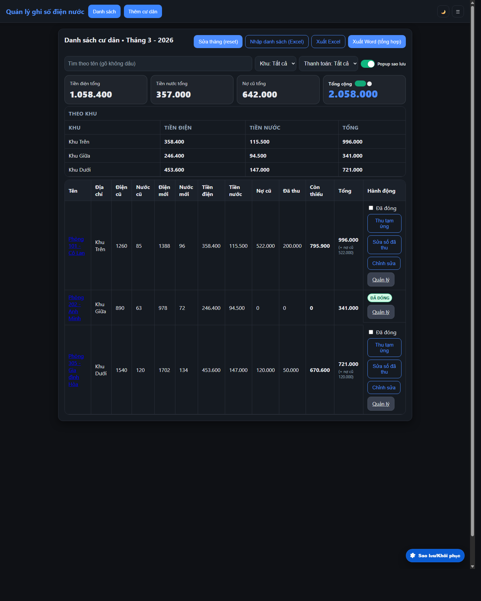
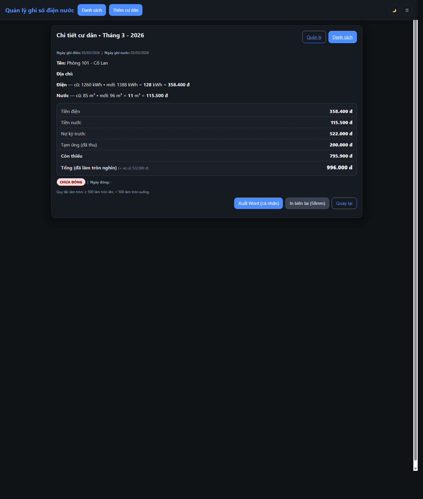
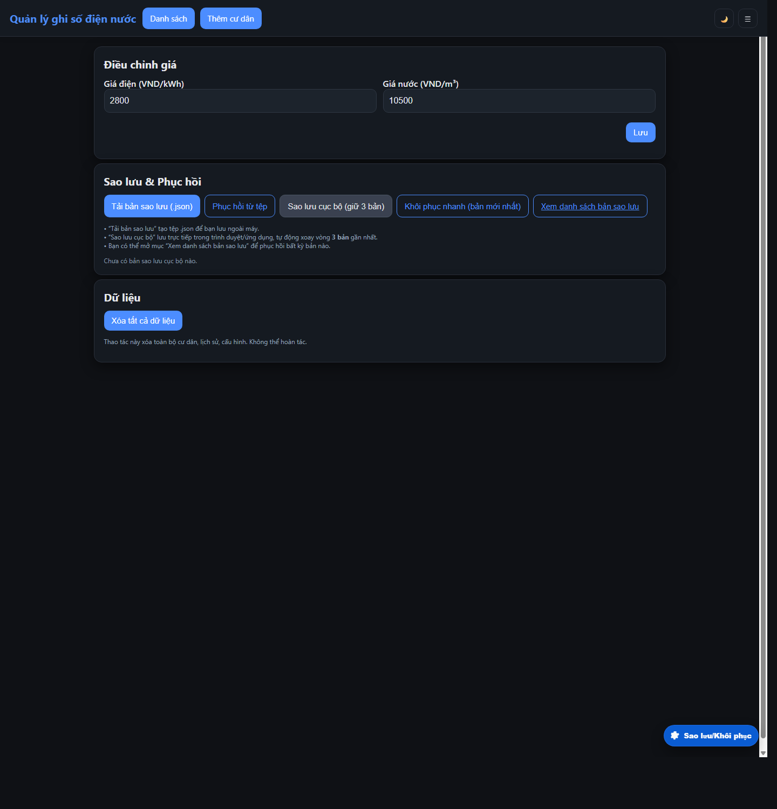
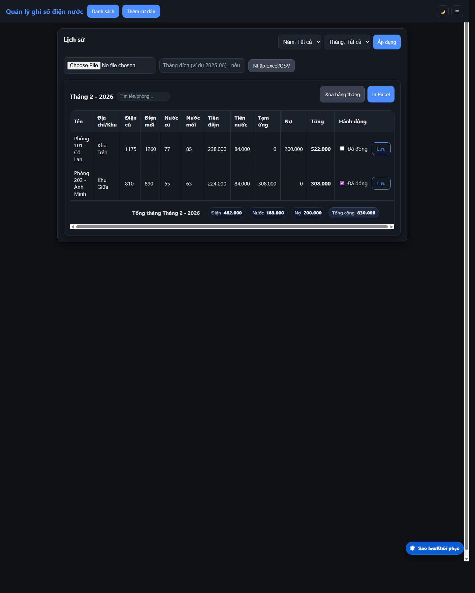

<p align="center">
  
</p>

<h1 align="center">Ứng Dụng Quản Lý Ghi Số Điện Nước</h1>

<p align="center">
  Ứng dụng web/PWA và Android APK giúp gia đình hoặc chủ trọ ghi chỉ số điện nước, tính tiền, theo dõi công nợ, in phiếu thu và đồng bộ nhiều thiết bị khi cần.
</p>

<p align="center">
  
  
  
  
  
</p>

## Giới thiệu

Đây là ứng dụng mình xây dựng để phục vụ nhu cầu quản lý điện nước trong thực tế cho gia đình và khu trọ nhỏ.

Ứng dụng tập trung vào các nhu cầu sử dụng hằng tháng:

- ghi chỉ số điện nước nhanh trên điện thoại hoặc trình duyệt
- tính tiền tự động theo đơn giá
- theo dõi nợ cũ, tạm ứng, đã đóng và còn thiếu
- lưu lịch sử theo từng tháng
- xuất phiếu thu, in biên lai và sao lưu dữ liệu
- đồng bộ nhiều máy khi cần dùng chung

## Ảnh giao diện thực tế

Các ảnh dưới đây được chụp trực tiếp từ bản build local của ứng dụng.

### 1. Màn danh sách cư dân



### 2. Màn chi tiết cư dân



### 3. Màn cấu hình giá và sao lưu



### 4. Màn lịch sử theo tháng



## Chức năng chính

- Quản lý danh sách cư dân/phòng đang sử dụng điện nước
- Ghi chỉ số điện nước theo tháng và tính tiền tự động
- Theo dõi nợ kỳ trước, tạm ứng, đã đóng và số còn thiếu
- Lưu lịch sử từng tháng, sửa tháng và tra cứu lại dữ liệu cũ
- Xuất phiếu thu Word, Excel và in biên lai 58mm
- Sao lưu, khôi phục và đồng bộ nhiều thiết bị qua Firebase room

## Toàn bộ chức năng hiện có trong ứng dụng

### 1. Quản lý cư dân và danh sách hiện tại

- Thêm cư dân/phòng mới
- Sửa thông tin cư dân, địa chỉ và khu vực
- Xóa cư dân khỏi danh sách hiện tại
- Phân loại theo khu `Khu Trên`, `Khu Giữa`, `Khu Dưới`, `Khác`
- Tìm kiếm tên theo kiểu gõ không dấu
- Lọc theo khu vực
- Lọc theo trạng thái `Đã đóng tiền` và `Chưa đóng tiền`
- Hiển thị tổng tiền điện, tổng tiền nước, tổng nợ cũ và tổng cộng ngay trên danh sách
- Bật/tắt chế độ cộng nợ cũ để xem nhanh tổng tiền tháng

### 2. Ghi chỉ số và tính tiền

- Nhập chỉ số điện cũ/mới
- Nhập chỉ số nước cũ/mới
- Tự tính sản lượng điện và nước tiêu thụ
- Tự tính tiền điện và tiền nước theo đơn giá đang cấu hình
- Tính tổng tiền có cộng nợ cũ
- Quản lý khoản tạm ứng đã thu
- Tính số tiền còn thiếu sau tạm ứng
- Đánh dấu `Đã đóng` để chốt thanh toán
- Thu tạm ứng nhanh ngay tại danh sách
- Màn quản lý riêng cho từng cư dân để chỉnh toàn bộ thông tin và xem trước số tiền

### 3. Quản lý tháng và lịch sử

- Chuyển tháng bằng chức năng `Sửa tháng (reset)`
- Tự lưu snapshot tháng trước vào lịch sử
- Reset tháng hiện tại để bắt đầu kỳ mới
- Dồn nợ từ lịch sử về tháng hiện tại
- Xem lịch sử theo từng tháng
- Lọc lịch sử theo năm và theo tháng
- Tìm kiếm từng cư dân trong từng bảng lịch sử
- Chỉnh lại trạng thái đã đóng/chưa đóng trong lịch sử
- Xóa riêng từng bảng tháng
- Hiển thị tổng điện, nước, nợ và tổng thu của từng tháng
- Nhập lịch sử từ file Excel `.xlsx`, `.xls`
- Nhập lịch sử từ file `.csv`
- Tự nhận cột dữ liệu phổ biến khi import lịch sử
- Xuất Excel theo từng tháng lịch sử

### 4. Phiếu thu, mẫu in và biên lai

- Xuất phiếu thu cho từng cư dân ra Word `.docx`
- Xuất phiếu thu tổng hợp cho toàn bộ danh sách ra Word `.docx`
- Tự fallback sang `.doc` nếu không tạo được `.docx`
- Xuất Excel tổng hợp danh sách tháng hiện tại
- Tùy chỉnh mẫu phiếu Word
- Tùy chỉnh mẫu biên lai nhiệt 58mm
- Lưu thông tin người quản lý/cửa hàng để in lên phiếu
- Xem trước biên lai trước khi in
- In bằng trình duyệt trên web
- In Bluetooth 58mm trên APK Android
- Lưu cấu hình in như font, số cột, số bản in
- In kèm QR thanh toán
- Chọn ảnh QR từ thư viện để app tự đọc nội dung QR
- Ghi nhớ nội dung QR cho các lần in sau

### 5. Sao lưu và khôi phục

- Tải bản sao lưu ra file JSON
- Khôi phục từ file JSON
- Sao lưu cục bộ ngay trong máy
- Giữ xoay vòng nhiều bản sao lưu gần nhất
- Xem danh sách các bản sao lưu cục bộ
- Xem nhanh thống kê từng bản sao lưu
- Tải lại riêng từng bản sao lưu bất kỳ
- Khôi phục bản sao lưu mới nhất chỉ với một nút bấm
- Khôi phục một bản sao lưu và đẩy lại dữ liệu lên room nếu đang dùng đồng bộ
- Xóa toàn bộ dữ liệu ứng dụng khi cần làm sạch

### 6. Đồng bộ nhiều thiết bị

- Đăng nhập Firebase để dùng chức năng đồng bộ
- Tạo phòng dùng chung và nhận mã phòng
- Nhập mã phòng để tham gia từ máy khác
- Rời phòng bất cứ lúc nào
- Đẩy toàn bộ dữ liệu hiện tại lên phòng
- Đồng bộ danh sách cư dân, lịch sử và tháng hiện tại giữa nhiều thiết bị
- Vẫn dùng offline bình thường khi không cần đồng bộ

### 7. Hỗ trợ sử dụng hằng ngày

- Chạy trực tiếp trên web
- Cài như PWA để dùng giống ứng dụng
- Đóng gói APK Android bằng Capacitor
- Dùng local storage và IndexedDB để lưu dữ liệu tại máy
- Hỗ trợ giao diện tối/sáng
- Ghi nhớ một số trạng thái thao tác để dùng liên tục thuận tiện hơn

## Công nghệ sử dụng

| Công nghệ | Vai trò |
| --- | --- |
| Vite 7 | Dev server và build |
| JavaScript ES Modules | Logic chính của ứng dụng |
| HTML/CSS | Giao diện |
| Capacitor 5 | Đóng gói APK Android |
| Firebase Auth + Firestore | Đồng bộ nhiều thiết bị |
| vite-plugin-pwa | Hỗ trợ PWA/offline |
| docx / ExcelJS / xlsx | Xuất Word và Excel |
| Bluetooth Serial + ESC/POS | In biên lai nhiệt |

## Cấu trúc dự án

```text
dien-nuoc-app/
|-- public/
|-- src/
|   |-- views/        # các màn hình chính
|   |-- state/        # logic dữ liệu và tính toán
|   |-- sync/         # Firebase, room sync, queue
|   |-- export/       # xuất Word / Excel
|   |-- print/        # in và xem trước biên lai
|   |-- ui/           # thành phần giao diện dùng chung
|   |-- utils/        # hàm tiện ích
|-- android/          # dự án Android qua Capacitor
|-- docs/
|   |-- images/
|   |-- screenshots/
```

## Cài đặt và chạy local

### Yêu cầu

- Node.js 18 trở lên
- npm 9 trở lên

### Cài đặt

```bash
git clone https://github.com/Duong200x/App-Web-diennuoc-.git
cd dien-nuoc-app
npm install
```

### Cấu hình môi trường

Nếu muốn dùng chức năng đồng bộ Firebase, tạo file `.env` từ `.env.example`:

```bash
copy .env.example .env
```

Điền các biến sau:

- `VITE_FB_API_KEY`
- `VITE_FB_AUTH_DOMAIN`
- `VITE_FB_PROJECT_ID`
- `VITE_FB_STORAGE_BUCKET`
- `VITE_FB_MESSAGING_SENDER_ID`
- `VITE_FB_APP_ID`

Nếu không cấu hình Firebase, ứng dụng vẫn chạy local để ghi số, tính tiền, sao lưu và xuất file trên một máy.

### Chạy local

```bash
npm run dev
```

Địa chỉ mặc định:

```text
http://localhost:5173
```

## Build

### Build web

```bash
npm run build
```

### Build APK Android

```bash
npm run build:apk
npx cap open android
```

## Tác giả

Phát triển bởi [Trần Đình Dương](https://github.com/Duong200x).
